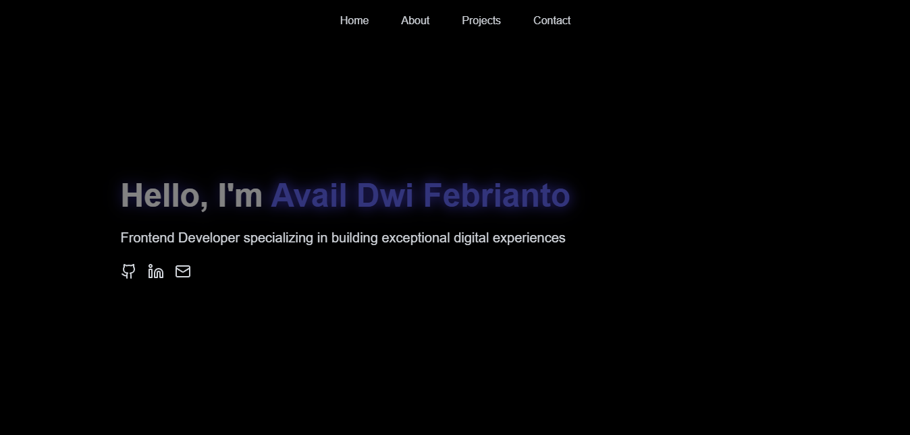

# 🚀 Portfolio with React

Haiii! Ini adalah projek portofolio aku yang dibuat pakai React. Simpel, estetik, dan tentunya anti-mainstream. 🎨✨

## ✨ Fitur

- **Home Page yang Kece:** Sambutan hangat buat para stalker.
- **About Me:** Semua tentang aku, tapi versi singkat biar nggak bosen.
- **Projects:** Pameran karya-karya kerenku.(masih belum ada wak)
- **Contact Me:** Kalau mau reach out, tinggal klik aja!

## 🛠️ Tools yang Dipakai

- **React JS:** Framework andalan buat front-end.
- **CSS:** Biar tampilannya nggak monoton.
- **Vite:** Supaya dev-nya kilat. ⚡

## 🚀 Cara Pakai

1. Clone repo ini:
   ```bash
   git clone https://github.com/xfbriianto/personal-portfolio
   ```
2. Masuk ke foldernya:
   ```bash
   cd personal-portfolio
   ```
3. Install dependencies:
   ```bash
   npm install
   ```
4. Jalanin app-nya:
   ```bash
   npm run dev
   ```
5. Buka di browser kamu: [http://localhost:3000](http://localhost:3000)

## 👀 Demo

> **Coming Soon** (Sabar ya, lagi otw deploy ke Netlify/ Vercel).
> ini dia demonya https://personal-portfolio-ten-pearl.vercel.app/

## 🤝 Kontribusi

Mau bantu ngembangin? Langsung aja pull request! Atau DM dulu biar asik ngobrolnya. 😎

## 📜 Lisensi

Projek ini open-source, silakan pakai atau ngoprek sesuka hati. Tapi jangan lupa kasih credit ya, biar kita tetap temenan. 😁

---

Selamat menikmati portofolio-ku, dan jangan lupa kasih feedback. Siapa tahu kamu mau kolab bareng! 🙌
